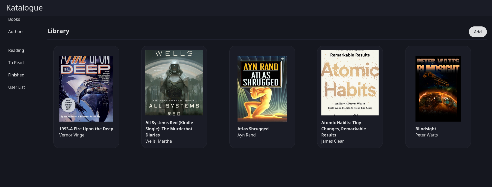
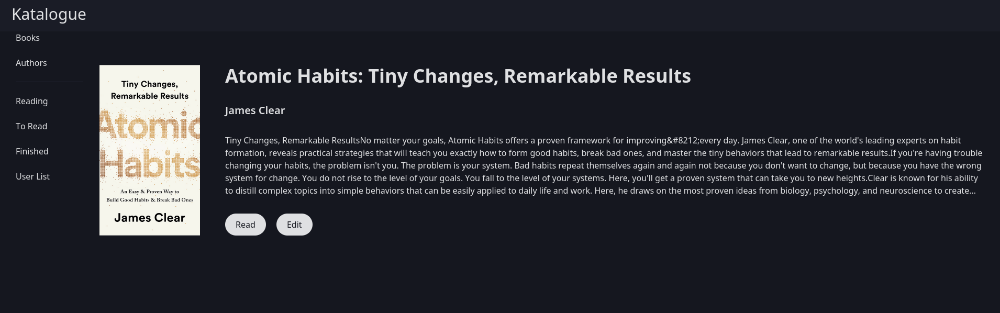
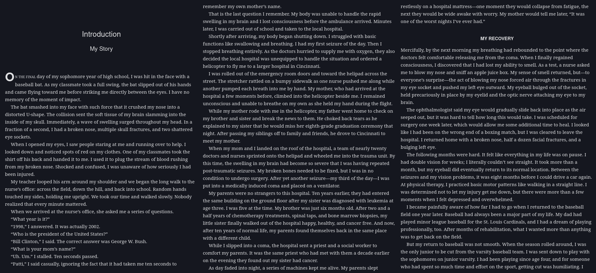

# katalogue
Katalogue is a simple webapp to manage and read ebooks. Upload books to the app and it will save them locally in the home directory.
You can search for books and add them to your wish-list or edit metadata of existing books. Search is powered by [ OpenLibraryAPI ](https://openlibrary.com)

Written with C# ASP.NET, Svelte/kit, PostgreSQL and [Skeleton](https://skeleton.dev). 

Examples:

Home page:

Book Page:

Read Page:

